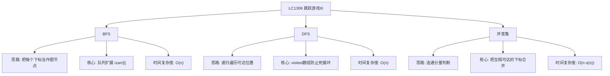

# 06-18-09-57 LC1306_跳跃游戏III解法分析
## 题目描述
给定一个非负整数数组 arr，你最开始位于该数组的起始下标 start 处。当你位于下标 i 处时，你可以跳到 i + arr[i] 或者 i - arr[i]。请你判断自己是否能够跳到对应元素值为 0 的 任一 下标处。注意，不管是什么情况下，你都无法跳到数组之外。
**示例：**
输入：arr = [4,2,3,0,3,1,2], start = 5
输出：true
解释：从下标 5 出发，可以到达下标 4，再到达下标 1，最后到达下标 3（值为 0）。
输入：arr = [4,2,3,0,3,1,2], start = 0
输出：true
解释：从下标 0 出发，可以到达下标 4，再到达下标 1，最后到达下标 3（值为 0）。
输入：arr = [3,0,2,1,2], start = 2
输出：false
解释：从下标 2 出发，无论怎么跳都无法到达值为 0 的下标 1。
## 解法概览
### 思维导图

## 记忆口诀
**BFS：** 数组变图节点，左右扩展找零值。
**DFS：** 递归深搜可达处，访问标记防循环。
**关键区别：** III能左右跳，I/II只能向前跳。
## 不同解法
### 解法一：BFS（面试推荐）
#### 思路
将数组中的每个下标看作图中的一个节点，从下标 i 可以到达 i + arr[i] 和 i - arr[i]（只要在数组范围内）。题目转化为：从 start 出发，能否到达任意一个值为 0 的节点。使用 BFS 逐层扩展，用 visited 数组避免重复访问和死循环。
#### 核心公式
- 节点：数组下标 i
- 边：i → i + arr[i] 和 i → i - arr[i]
- 终止条件：arr[i] == 0
- 访问标记：visited[i] = true
#### 图解过程
以 arr = [4,2,3,0,3,1,2], start = 5 为例：
- 初始队列：[5]，visited[5]=true
- 弹出 5：arr[5]=1，可到达 4、6
- 队列：[4, 6]，visited[4]=true，visited[6]=true
- 弹出 4：arr[4]=3，可到达 1、7（7越界）
- 队列：[6, 1]，visited[1]=true
- 弹出 6：arr[6]=2，可到达 4（已访问）、8（越界）
- 队列：[1]
- 弹出 1：arr[1]=2，可到达 -1（越界）、3
- 队列：[3]，visited[3]=true
- 弹出 3：arr[3]=0 → 返回 true
#### 代码示例（带详细注释）
```java
public boolean canReach(int[] arr, int start) {
    int n = arr.length;
    // 记录访问过的下标，防止在两个位置之间来回跳动造成死循环
    boolean[] visited = new boolean[n];
    Queue<Integer> queue = new LinkedList<>();
    queue.offer(start);
    visited[start] = true;

    while (!queue.isEmpty()) {
        int i = queue.poll();
        // 只要到达任意值为0的下标，就返回true
        if (arr[i] == 0) {
            return true;
        }
        int step = arr[i];
        // 向右跳
        int right = i + step;
        if (right < n && !visited[right]) {
            visited[right] = true;
            queue.offer(right);
        }
        // 向左跳
        int left = i - step;
        if (left >= 0 && !visited[left]) {
            visited[left] = true;
            queue.offer(left);
        }
    }
    // 队列已空，说明所有可达位置都访问过，仍未找到值为0的下标
    return false;
}
```
#### 复杂度分析
- 时间复杂度：O(n)，每个下标最多被访问一次
- 空间复杂度：O(n)，需要队列和 visited 数组
#### 优缺点
- **优点：**
  - 思路直观，容易在面试中讲清楚
  - 天然适合"能否到达"类问题
  - 代码结构清晰，不易出错
- **缺点：** 需要额外 O(n) 空间
### 解法二：DFS
#### 思路
使用递归深度优先搜索，从 start 出发，每次尝试向左或向右跳跃。同样需要 visited 数组避免重复访问和死循环。当遇到 arr[i] == 0 时返回 true。
#### 核心公式
- dfs(i)：从下标 i 出发能否到达值为 0 的下标
- 终止条件：i 越界、i 已访问、arr[i] == 0
- 递归：dfs(i + arr[i]) || dfs(i - arr[i])
#### 代码示例
```java
public boolean canReach(int[] arr, int start) {
    boolean[] visited = new boolean[arr.length];
    return dfs(arr, start, visited);
}

private boolean dfs(int[] arr, int i, boolean[] visited) {
    // 越界或已访问，返回false
    if (i < 0 || i >= arr.length || visited[i]) {
        return false;
    }
    // 找到值为0的下标
    if (arr[i] == 0) {
        return true;
    }
    visited[i] = true;
    // 向左或向右跳，任一能到达即可
    return dfs(arr, i + arr[i], visited) || dfs(arr, i - arr[i], visited);
}
```
#### 复杂度分析
- 时间复杂度：O(n)，每个下标最多访问一次
- 空间复杂度：O(n)，递归栈和 visited 数组
#### 优缺点
- 优点：代码简洁
- 缺点：递归深度可能较大，有栈溢出风险
### 解法三：并查集
#### 思路
把每个下标看作一个节点，将 i 与 i + arr[i]、i - arr[i] 合并。最后检查 start 是否与任意一个值为 0 的下标在同一个连通分量中。
#### 核心公式
- union(i, j)：合并下标 i 和 j
- find(i)：查找 i 的根节点
- 结果：存在 arr[i] == 0 且 find(start) == find(i)
#### 复杂度分析
- 时间复杂度：O(n α(n))，α 为阿克曼函数反函数
- 空间复杂度：O(n)
#### 优缺点
- 优点：思路独特，适合展示多种解法
- 缺点：代码相对复杂，不推荐作为面试首选
## 面试回答模板
**问题：** 给定数组 arr 和起始下标 start，每次可以向左或向右跳 arr[i] 步，能否到达值为 0 的下标？
**回答：**
这是一道图上的可达性问题。我把数组的每个下标看作图中的一个节点，从下标 i 可以到达 i + arr[i] 和 i - arr[i]。问题就转化为：从 start 出发，能否到达任意一个值为 0 的节点。
我推荐使用 BFS 来解决：
1. 用队列保存待访问的下标，初始放入 start。
2. 用 visited 数组记录访问过的下标，防止在两个下标之间来回跳导致死循环。
3. 每次从队列取出一个下标，如果对应值为 0，直接返回 true。
4. 否则将 i + arr[i] 和 i - arr[i] 中合法且未访问过的下标加入队列。
5. 如果队列为空还没有找到 0，返回 false。
时间复杂度 O(n)，空间复杂度 O(n)。
**关键区分点：** 这道题和 LC55/LC45 最大的不同是它可以向左跳，而且每次跳跃距离固定为 arr[i]，所以贪心不再适用，需要用 BFS 或 DFS 这类图搜索算法。
## 相关题目
1. **LC55：跳跃游戏** - 判断是否可以到达终点（贪心）
2. **LC45：跳跃游戏II** - 计算最少跳跃次数（贪心）
3. **LC1345：跳跃游戏IV** - 最少跳跃次数（BFS）
4. **LC1696：跳跃游戏VI** - 最大得分跳跃（单调队列/DP）
这些题目都涉及跳跃游戏的不同变体，核心区别在于跳跃方向和目标函数。
